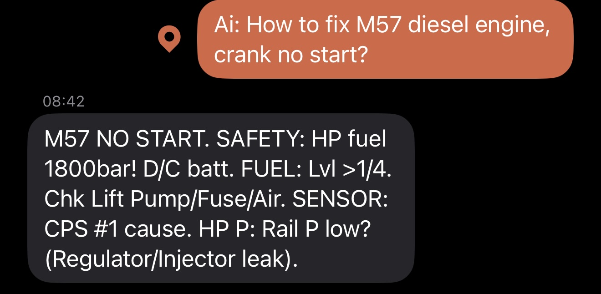

# Garmin AI Gateway

A Google Apps Script service that bridges Garmin InReach satellite messengers with AI responses via Gmail and Google Gemini Interactions API. This gateway enables remote users with satellite messengers to access frontier AI with automatic web search and URL reading, plus weather data, news, and other information tools for wilderness activities or areas without cellular coverage.

Powered by Google's Gemini Interactions API with built-in Google Search and conversation memory.

Coded with Claude.



*Actual response to a diesel engine troubleshooting query - demonstrating the system's ability to provide technical diagnostic steps within satellite message constraints*

## Features

### Core Capabilities
- **AI-Powered Responses**: Uses Google Gemini Interactions API for intelligent, context-aware responses optimized for satellite messaging constraints
- **Automatic Web Search**: Built-in Google Search integration - AI automatically searches the web when needed for current information
- **Conversation Memory**: Server-side conversation storage maintains context for 24 hours, enabling follow-up questions and multi-turn interactions
- **Smart Compression**: Two-phase AI processing that first analyzes queries then compresses responses to fit within Garmin's 160-character limit
- **Multi-Page Support**: Automatically paginates longer responses across multiple messages
- **Retry Mechanism**: Built-in retry logic for handling temporary API failures

### Automatic Features (No Keywords Needed)
- **Web Search**: AI automatically searches Google when it needs current information
- **Conversation Context**: Remembers previous messages for 24 hours (server-side storage)

### Manual Tools
Users can trigger specialized tools by including keywords in their messages:

- **`WIKI <term>`**: Wikipedia article summaries
- **`NEWS`**: Latest news headlines
- **`WEATHER`**: Current weather and forecast (requires GPS coordinates)
- **`SUNRISE/SUNSET`**: Astronomy data (requires GPS coordinates)
- **`FULL-WEATHER`**: Comprehensive weather data including UV, pressure, moon phase
- **`DISASTERS`**: GDACS disaster alerts for nearby area (requires GPS coordinates)
- **`ADDRESS`**: Reverse geocoding to get location name (requires GPS coordinates)
- **`NEW`**: Start a fresh conversation (resets 24-hour context memory)
- **`SIZE <number>`**: Override response length (e.g., `SIZE 500` for 500 characters)
- **`HELP`**: Display available commands

## Installation

### Prerequisites
1. Google account with access to Google Apps Script
2. Garmin InReach device with active subscription
3. Gmail account that receives InReach messages
4. Google Gemini API key

### Setup Steps

1. **Create a new Google Apps Script project**
   - Go to [script.google.com](https://script.google.com)
   - Click "New project"
   - Name your project (e.g., "Garmin AI Gateway")

2. **Add the source files**
   - Copy all `.js` and `.gs.js` files from this repository
   - In the Apps Script editor, create new script files for each:
     - `Code.js` (main file - this is already created by default)
     - `GeminiInteractionsClient.gs.js` (NEW - Interactions API client)
     - `InteractionStateManager.gs.js` (NEW - conversation state management)
     - `HttpClient.gs.js`
     - `WikipediaTool.gs.js`
     - `WeatherTool.gs.js`
     - `NewsTool.gs.js`
     - `GdacsTool.gs.js`
     - `ReverseGeocodeTool.gs.js`
     - (Note: SearchTool.gs.js and BrowseTool.gs.js are no longer needed - replaced by built-in tools)
     - (Add test files if you want to run tests)

3. **Configure the manifest**
   - Click on Project Settings (gear icon)
   - Check "Show 'appsscript.json' manifest file in editor"
   - Replace the contents of `appsscript.json` with the one from this repository

4. **Set up the Gemini API key**
   - Get a Gemini API key from [Google AI Studio](https://makersuite.google.com/app/apikey)
   - In Apps Script editor, go to Project Settings
   - Scroll to "Script Properties"
   - Add a new property:
     - Property name: `GEMINI_KEY`
     - Value: Your Gemini API key

5. **Configure Gmail permissions**
   - Run the `runGateway` function once manually
   - Accept the permission prompts to allow access to Gmail

6. **Set up the time-based trigger**
   - In Apps Script editor, click on "Triggers" (clock icon)
   - Add a new trigger:
     - Function: `runGateway`
     - Event source: Time-driven
     - Type: Minutes timer
     - Interval: Every 1 minutes (or your preference)

7. **Configure your InReach device**
   - Send messages directly from your InReach device to any email address you monitor with Gmail
   - Messages must start with "AI: " to be processed
   - Enable "Send Location" in message settings for GPS-based features to work

## Usage

### Sending Messages
From your Garmin InReach device, send messages to your configured contact with the format:
```
AI: your question here
```

Examples:
- `AI: What's the weather forecast?` (needs GPS enabled - AI will use location data)
- `AI: WIKI first aid for snake bites` (Wikipedia lookup)
- `AI: What are current trail conditions on the PCT in Washington?` (AI automatically searches web)
- `AI: Check https://weather.gov for alerts in my area` (AI automatically reads URL)
- `AI: NEWS` (manual news tool)
- `AI: How do I purify water in the wilderness?` (general knowledge + automatic search if needed)
- `AI: SIZE 300 Explain how to build a shelter` (override response length)
- `AI: NEW What's the capital of France?` (start fresh conversation, forget previous context)

### GPS-Based Features
To use location-based tools (weather, astronomy, disasters, address), enable "Send Location" in your InReach message settings. The gateway will automatically extract coordinates from the message.

## Configuration

Key settings can be modified in `Code.js`:

```javascript
const SYSTEM = {
  TRUSTED_EMAILS: ["no.reply.inreach@garmin.com"],  // Emails to accept messages from
  MODEL_TAG: "gemini-flash-latest",                  // Gemini model for Interactions API
  SEARCH_WINDOW: "newer_than:2d",                    // Gmail search window
  MAX_RETRIES: 3,                                    // Retry attempts for failures
  ALERT_EMAIL: null,                                 // Optional admin alert email
  CONVERSATION_EXPIRY_HOURS: 24                      // Auto-start new conversation after this period
};
```

## Testing

The project includes comprehensive test suites:

```bash
# Run unit tests
npm test

# Run integration tests
npm run test:integration

# Verify syntax
npm run verify

# Lint code
npm run lint
```

## Architecture

- **Email Processing**: Monitors Gmail for InReach messages and extracts queries
- **Garmin Reply Handling**: Supports both legacy URLs and new `inreachlink.com` short URLs with automatic form value extraction
- **Interactions API Client**: Uses Gemini Interactions API (`/v1beta/interactions`) with built-in Google Search
- **Conversation State Management**: Tracks interaction IDs for 24-hour conversation continuity via server-side storage
- **Tool System**: Modular tools for specialized data sources (Wikipedia, weather, news, disasters)
- **AI Pipeline**: Two-phase processing - analysis with tools, then compression
- **Message Pagination**: Splits long responses into multiple 160-character messages
- **Error Handling**: Comprehensive retry logic and user-visible error messages
- **Dependency Injection**: Testable architecture with mock-friendly design

## Security Considerations

- Only processes emails from trusted Garmin email addresses
- Requires explicit "AI:" prefix to prevent accidental processing
- API keys stored in Script Properties (not in code)
- No storage of message content beyond processing

## Limitations

- Response limited by satellite message constraints (160 chars per page)
- API rate limits apply (Gemini, weather services, etc.)
- Some tools require GPS coordinates from InReach device
- Processing runs on schedule (not real-time)

## License

MIT License - See LICENSE file for details

## Contributing

Contributions are welcome! Please ensure all tests pass and add appropriate test coverage for new features.

## Support

For issues or questions, please open an issue on GitHub.