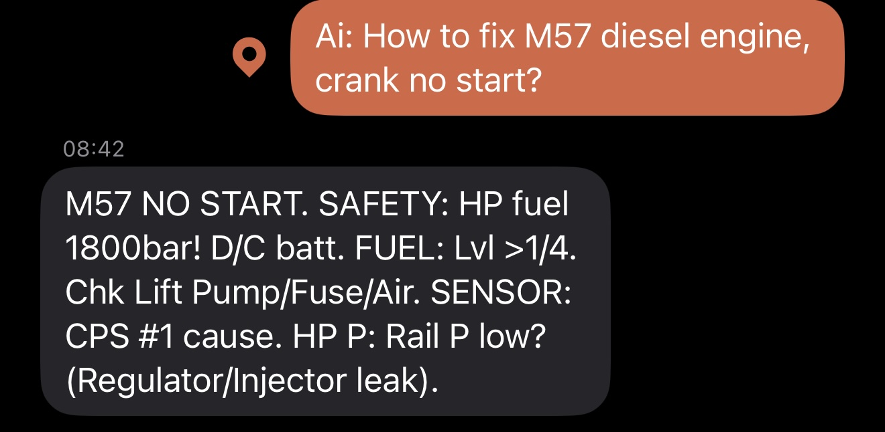

# Garmin AI Gateway

A Google Apps Script service that bridges Garmin InReach satellite messengers with AI responses via Gmail and Google Gemini Interactions API. This gateway enables remote users with satellite messengers to access frontier AI with automatic web search and URL reading, plus weather data, news, and other information tools for wilderness activities or areas without cellular coverage.

Powered by Google's Gemini Interactions API with built-in Google Search and conversation memory.

Coded with Claude.



*Actual response to a diesel engine troubleshooting query - demonstrating the system's ability to provide technical diagnostic steps within satellite message constraints*

## Features

### Core Capabilities
- **AI-Powered Responses**: Uses Google Gemini Interactions API for intelligent, context-aware responses optimized for satellite messaging constraints
- **Automatic Web Search**: Built-in Google Search integration - AI automatically searches the web when needed for current information
- **Conversation Memory**: Server-side conversation storage maintains context for 24 hours, enabling follow-up questions and multi-turn interactions
- **Readable Brevity**: Replies are written to a character budget (350 target, 700 hard maximum) in plain English rather than compressed into telegram-style abbreviations. A second shrink pass runs only when an answer overshoots the budget, and it is instructed to keep every safety warning, dose and quantity
- **Resumable Pagination**: Long replies are split into pages that always fit the device limit, prefixed `1/4`, `2/4`, and delivered in order. Progress is checkpointed after each page, so a run interrupted by the Apps Script 6-minute limit or a transient Garmin failure resumes at the next unsent page instead of replaying the whole reply
- **Retry Mechanism**: Per-page delivery retries plus message-level retry logic for temporary API failures

### Automatic Features (No Keywords Needed)
- **Web Search**: AI automatically searches Google when it needs current information
- **Conversation Context**: Remembers previous messages for 24 hours (server-side storage)

### Manual Tools
Users can trigger specialized tools by including keywords in their messages:

- **`WIKI <term>`**: Wikipedia article summaries
- **`NEWS`**: Latest news headlines
- **`WEATHER`**: Current weather and forecast (requires GPS coordinates)
- **`SUNRISE/SUNSET`**: Astronomy data (requires GPS coordinates)
- **`FULL-WEATHER`**: Comprehensive weather data including UV, pressure, moon phase
- **`DISASTERS`**: GDACS disaster alerts for nearby area (requires GPS coordinates)
- **`WHERE AM I`**: Reverse geocoding to get location name (requires GPS coordinates)
- **`NEW:`**: Start a fresh conversation, resetting the 24-hour context memory. Use it alone (`NEW`) or as a prefix followed by punctuation (`NEW: how do I splint a wrist`). The punctuation is required so that ordinary questions beginning with the word "new" do not silently discard your conversation
- **`SIZE <number>`**: Override response length (e.g., `SIZE 500` for 500 characters, capped at 2000)
- **`HELP`**: Display available commands

## Installation

### Prerequisites
1. Google account with access to Google Apps Script
2. Garmin InReach device with active subscription
3. Gmail account that receives InReach messages
4. Google Gemini API key

### Setup Steps

1. **Create a new Google Apps Script project**
   - Go to [script.google.com](https://script.google.com)
   - Click "New project"
   - Name your project (e.g., "Garmin AI Gateway")

2. **Add the source files**

   The simplest route is `npm run push`, which uses `clasp` and the `.claspignore`
   whitelist to upload exactly the right set of files. To do it by hand, create a
   script file in the Apps Script editor for each of:

   | File | Responsibility |
   | --- | --- |
   | `Code.js` | Entry point `runGateway()` and the request pipeline |
   | `Config.gs.js` | All tunables, limits and AI prompts |
   | `MessageParser.gs.js` | Parsing inbound Garmin notification emails |
   | `Toolbox.gs.js` | Tool triggers and TOOL CONTEXT assembly |
   | `Pager.gs.js` | Page splitting, ordered delivery, resume state |
   | `GarminClient.gs.js` | Garmin reply-page parsing and POSTs |
   | `Utils.gs.js` | Text shaping, retry bookkeeping, alerting |
   | `GeminiInteractionsClient.gs.js` | Interactions API client |
   | `InteractionStateManager.gs.js` | Conversation continuity |
   | `HttpClient.gs.js` | Injectable HTTP layer used by the tools |
   | `WikipediaTool.gs.js` etc. | Individual data-source tools |

   Test files (`*.test.gs.js`, `TestRunner.gs.js`, `IntegrationTests.gs.js`) are
   optional in the editor but are pushed by default so `runAllTests()` can be run
   from the Apps Script UI.

   (SearchTool.gs.js and BrowseTool.gs.js are gone - the Interactions API's
   built-in Google Search and URL Context tools replaced them.)

3. **Configure the manifest**
   - Click on Project Settings (gear icon)
   - Check "Show 'appsscript.json' manifest file in editor"
   - Replace the contents of `appsscript.json` with the one from this repository

4. **Set up the Gemini API key**
   - Get a Gemini API key from [Google AI Studio](https://makersuite.google.com/app/apikey)
   - In Apps Script editor, go to Project Settings
   - Scroll to "Script Properties"
   - Add a new property:
     - Property name: `GEMINI_KEY`
     - Value: Your Gemini API key

5. **Configure Gmail permissions**
   - Run the `runGateway` function once manually
   - Accept the permission prompts to allow access to Gmail

6. **Set up the time-based trigger**
   - In Apps Script editor, click on "Triggers" (clock icon)
   - Add a new trigger:
     - Function: `runGateway`
     - Event source: Time-driven
     - Type: Minutes timer
     - Interval: Every 1 minutes (or your preference)

7. **Configure your InReach device**
   - Send messages directly from your InReach device to any email address you monitor with Gmail
   - Messages must start with "AI: " to be processed
   - Enable "Send Location" in message settings for GPS-based features to work

## Usage

### Sending Messages
From your Garmin InReach device, send messages to your configured contact with the format:
```
AI: your question here
```

Examples:
- `AI: What's the weather forecast?` (needs GPS enabled - AI will use location data)
- `AI: WIKI first aid for snake bites` (Wikipedia lookup)
- `AI: What are current trail conditions on the PCT in Washington?` (AI automatically searches web)
- `AI: Check https://weather.gov for alerts in my area` (AI automatically reads URL)
- `AI: NEWS` (manual news tool)
- `AI: How do I purify water in the wilderness?` (general knowledge + automatic search if needed)
- `AI: SIZE 300 Explain how to build a shelter` (override response length)
- `AI: NEW: What's the capital of France?` (start fresh conversation, forget previous context)

### GPS-Based Features
To use location-based tools (weather, astronomy, disasters, address), enable "Send Location" in your InReach message settings. The gateway will automatically extract coordinates from the message.

## Configuration

Everything tunable lives in `Config.gs.js`.

```javascript
const SYSTEM = {
  TRUSTED_EMAILS: ["no.reply.inreach@garmin.com"],  // Emails to accept messages from
  MODEL_TAG: "gemini-flash-latest",                  // Gemini model for Interactions API
  SEARCH_WINDOW: "newer_than:2d",                    // Gmail search window
  SIMULATE_GARMIN: false,                            // true = log replies instead of sending
  DEBUG_MODE: false,                                 // Verbose logging
  ALERT_EMAIL: null,                                 // Optional admin alert email
  CONVERSATION_EXPIRY_HOURS: 24,                     // Auto-start new conversation after this period
  MAX_THREADS_PER_RUN: 10,                           // Gmail threads inspected per execution
  EXECUTION_BUDGET_MS: 4.5 * 60 * 1000               // Stop before the 6-minute Apps Script kill
};
```

### Response length and message quota

This is the setting to think about, because every page costs one satellite
message off your InReach plan.

```javascript
const LIMITS = {
  GARMIN_SAFE_MAX: 155,   // Per-message ceiling, including the "3/7 " prefix
  AI_TARGET_LENGTH: 350,  // What the model aims for  (~2-3 pages)
  AI_ABSOLUTE_MAX: 700,   // Hard ceiling             (~5 pages)
  SIZE_OVERRIDE_MAX: 2000,// Ceiling for an explicit "SIZE n"
  MAX_PAGES: 16,          // Safety valve
  PAGE_DELAY_MS: 5000     // Pacing between pages
};
```

Raising `AI_TARGET_LENGTH` and `AI_ABSOLUTE_MAX` buys more detail at a
proportional cost in messages. A single `SIZE n` in a message overrides both for
that reply only.

### How a reply is produced

1. Tools that the message triggers are run, and their output (or an explicit
   failure note) becomes the TOOL CONTEXT block.
2. One Interactions API call answers the question. The character budget is part
   of the prompt, and the prompt explicitly forbids telegram-style abbreviation.
3. If the answer exceeds `AI_ABSOLUTE_MAX`, a second call shortens it while
   preserving safety warnings and numbers. Boundary-aware truncation is the last
   resort, and it marks the cut.
4. `Pager.gs.js` splits the result into pages that fit `GARMIN_SAFE_MAX`
   including the page prefix, then sends them in order, checkpointing progress
   after each one.

## Testing

The project includes comprehensive test suites:

```bash
# Run unit tests
npm test

# Run integration tests
npm run test:integration

# Verify syntax
npm run verify

# Lint code
npm run lint
```

## Architecture

- **Email Processing** (`MessageParser.gs.js`): Monitors Gmail for InReach messages and extracts the query, the reply link and any GPS coordinates. Gmail hard-wraps the plain-text body, so the message is reassembled across lines rather than read from the first line only
- **Garmin Reply Handling** (`GarminClient.gs.js`): Supports both legacy URLs and `inreachlink.com` short URLs, with automatic form-value extraction. One session is opened per reply and reused for every page
- **Interactions API Client** (`GeminiInteractionsClient.gs.js`): Uses the Gemini Interactions API (`/v1beta/interactions`) with built-in Google Search and URL Context. Collects the model's prose after the last tool step, skipping reasoning steps, and detects token-limit truncation
- **Conversation State** (`InteractionStateManager.gs.js`): Tracks interaction IDs for 24-hour continuity via server-side storage
- **Tool System** (`Toolbox.gs.js` + `*Tool.gs.js`): Modular tools for specialized data sources (Wikipedia, weather, news, disasters, geocoding)
- **AI Pipeline** (`Code.js`): A single budgeted call, with a conditional shrink pass on overshoot
- **Message Pagination** (`Pager.gs.js`): Prefix-aware splitting, ordered delivery, per-page retries and resume-after-interruption
- **Error Handling**: Message-level retry logic and user-visible error messages on the device
- **Dependency Injection**: Testable architecture with mock-friendly design; the paging and parsing logic is pure and covered by unit tests

## Security Considerations

- Only processes emails from trusted Garmin email addresses
- Requires explicit "AI:" prefix to prevent accidental processing
- API keys stored in Script Properties (not in code)
- No storage of message content beyond processing

## Limitations

- Response limited by satellite message constraints (155 chars per page, including the page prefix)
- Every page consumes one message from your InReach plan; see *Response length and message quota*
- API rate limits apply (Gemini, weather services, etc.)
- Some tools require GPS coordinates from InReach device
- Processing runs on schedule (not real-time)
- Apps Script caps an execution at 6 minutes. Replies that cannot finish in that window checkpoint and resume on the next run, so the final pages may arrive a minute or two later

## License

MIT License - See LICENSE file for details

## Contributing

Contributions are welcome! Please ensure all tests pass and add appropriate test coverage for new features.

## Support

For issues or questions, please open an issue on GitHub.